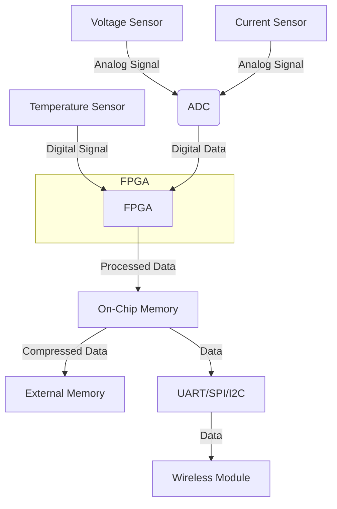

* TOC
{:toc}

{{site.data.alerts.note}}
***기술 핵심은:*** Creative symbiosis 원칙하에 AI --> Actionable AI, LLM --> LAM (large actionable model), GPU(그래픽카드) -->FPGA(Field programmable gate array 반도체소자)로 일대 혁신 중. <br/>
***결과물은:*** HMI (human machine interaction), 서빙로봇, 바리스타, 자율 주차, 자율 내시경 캡슐등 FPGA의 특징인 응답성과 결정성, 에너지 효율을 활용 함. <br/>
***관련 ISO등:*** 항공우주(DO-254), 자동차(ISO 26262), 산업(IEC 61508), 기계(ISO 13849), 철도(EN 50128, EN 50657), IT(ISO/IEC 15408), 의료(IEC 62304, ISO 14971)가 포함!
{{site.data.alerts.end}}



## prototyping
When the goal is to collect battery parameters such as voltage, current, ambient temperature, cycles, etc., within a constrained FPGA environment, the focus shifts to ensuring efficient data acquisition, processing, and storage. Here are some strategies and considerations for such an application:

### Strategies for Efficient Data Collection and Processing on FPGA

1. **Sensor Integration**:
   - **Analog-to-Digital Converters (ADC)**: Integrate high-resolution ADCs to convert analog signals (voltage, current) from sensors into digital data for the FPGA to process.
   - **Digital Sensors**: Use digital sensors for ambient temperature and other parameters to simplify integration.

2. **Data Sampling and Preprocessing**:
   - **Sampling Rate Optimization**: Choose appropriate sampling rates to balance between data resolution and processing requirements.
   - **Signal Conditioning**: Implement signal conditioning techniques such as filtering and amplification on FPGA to improve data quality.

3. **Efficient Data Storage**:
   - **Data Compression**: Apply data compression algorithms to reduce the amount of data stored.
   - **Memory Management**: Efficiently manage internal FPGA memory and use external memory for large datasets.

4. **Real-Time Processing**:
   - **Parallel Processing**: Utilize the parallel processing capabilities of FPGA to handle multiple data streams simultaneously.
   - **Custom IP Cores**: Develop custom IP cores for specific tasks such as signal processing, feature extraction, and data logging.

5. **Low-Power Design**:
   - **Power Management**: Implement power management techniques to minimize energy consumption during data acquisition and processing.
   - **Energy-Efficient Algorithms**: Use energy-efficient algorithms for data processing to extend battery life.

### Implementation Example

Here is an outline of how you could implement a system to collect and process battery parameters on an FPGA:

1. **Sensor Integration and Data Acquisition**:
   - **Voltage and Current Sensors**: Connect voltage and current sensors to ADCs. For example, use an ADS1115 ADC for high-resolution measurements.
   - **Temperature Sensors**: Use digital temperature sensors like the DS18B20 for ambient temperature measurements.

2. **FPGA Data Processing Pipeline**:
   - **Analog Signal Conditioning**: Apply filtering and amplification to sensor signals before ADC conversion.
   - **Digital Conversion**: Use the ADCs to convert analog signals to digital data.
   - **Data Processing**: Implement data processing algorithms on the FPGA. For instance, calculate average voltage, current, and temperature over specified intervals.

3. **Data Storage and Transmission**:
   - **On-Chip Memory**: Store processed data in the FPGA’s on-chip memory temporarily.
   - **External Memory**: Transfer data to external memory if the internal memory is insufficient.
   - **Data Compression**: Compress data before storage to save space.

4. **Communication Protocol**:
   - **UART/SPI/I2C**: Use UART, SPI, or I2C protocols for communication between the FPGA and other devices or microcontrollers.
   - **Wireless Communication**: Integrate wireless communication modules (e.g., Bluetooth, Wi-Fi) if remote data transmission is required.

### Sample FPGA Block Diagram



<script src="https://gist.github.com/aiegoo/407a7a63c1a84fde581dd05d1c6820ee.js"></script>


### Optimized Design Considerations

- **FPGA Choice**: Choose an FPGA with sufficient logic elements and memory resources, like the Xilinx Spartan-6 or Intel Cyclone series, which are optimized for embedded applications.
- **Custom Logic Development**: Develop custom logic for ADC interface, data processing, and compression in VHDL or Verilog.
- **Power Efficiency**: Implement low-power design techniques and choose low-power FPGAs to extend battery life.

### Conclusion

By integrating appropriate sensors, optimizing data processing algorithms, and efficiently managing memory, you can successfully collect and process battery parameters on an FPGA within a constrained resource environment. This approach ensures real-time data acquisition and processing while maintaining energy efficiency, making it suitable for edge applications.

### Summary of Hardware Requirements for Battery Maintenance Project

#### Prototype Development Process
- **Directors**: Lxx (x2)
- **Manager**: Lxxx
- **Team Leader**: Kxxx




#### 1) Planning & Hardware Installation

##### A. Analysis of Communication Requirements with UBSS
- **Goal**: Set up a flexible platform utilizing FPGAs, GPUs, multicore CPUs, and parallel processing architectures.
- **Data Communication**: 
  - Frequency and rate: 1-second interval, 100Hz sampling.
  - Security: Data encryption and authentication.

##### B. Selection of Communication Protocol and Hardware Components
- **Protocols**: USB-JTAG + USB-SPI for camera and FPGA development board.
- **Camera Interface Data Transfer**:
  - **pclk**: Synchronization clock, always active.
  - **href**: Line transmission.
  - **vsync**: Starts a new image.
  - **pixel_data**: 8-bit bus for pixel information during pclk.
  - **sio_c/sio_d**: I2C-like interface for sensor configuration.
- **FPGA Development**: Choose a language (Verilog, VHDL) and develop.
- **Optimization**: Data processing and storage capacity according to cost.
- **Power & Environmental**: Compliance with operating conditions (temperature, humidity, vibration).

##### C. Raspberry Pi-Based Hardware Design
- **Raspberry Pi 5, 8GB**.
- **PoE HAT**: Reliable power and data communication with FPGAs.
- **CAN Communication**: For environmental data collection (modules like MCP2515, MCP25625).
- **Sensors**: Temperature, humidity, vibration sensors (DHT22, BME280, ADXL345).
- **PCB Design**: Circuit design, component selection, SMT process.
- **Case Design**: Protection, heat dissipation, and interfaces.

##### D. Network Setup and Data Communication
- **Stable Communication**: PoE cabling, PoE switches.
- **Security**: Firewall settings, encryption.

#### 2) Software Development and System Integration

##### A. Develop and Train AI Models
- **Machine Learning Algorithms**: SVM, KNN, Random Forest, LSTM.
- **Data Preparation**: Labeling operations for charge-discharge cycles.
- **OCR Library**: Tesseract-OCR.

##### B. Implementation of Communication Protocols
- **Protocols**: Data sending, receiving, error handling.
- **Clock Modules**: Clock wizard for reliable clock management.
- **Data Protocols**: Design data format, packet structure, and validation.

##### C. System Integration and Testing
- **Hardware and Software Integration**: Communication, data processing, notifications.
- **Validation**: Anomaly detection accuracy, system response speed.
- **Optimization**: Bug fixes, performance improvements.

### Use Case Utilizing ZCU102

- **High-Performance Computing**: Leverage ZCU102 for FPGA-based acceleration of computationally intensive tasks.
- **Image Processing**: Utilize ZCU102 for real-time image processing applications, integrating with high-resolution cameras.
- **Embedded AI**: Deploy AI models on ZCU102 for tasks such as object detection, anomaly detection, and predictive maintenance.
- **Data Acquisition and Processing**: Interface with various sensors and collect environmental data, processing it on the FPGA.
- **Edge Computing**: Perform localized processing on ZCU102, reducing the need for data transfer to centralized servers, enhancing response times, and improving data privacy.

### Verilog/VHDL Quadruple Precision Karatsuba Multiplier

- **Quadruple Precision**: Handles floating-point numbers with greater precision (128-bit) compared to standard double precision (64-bit).
- **Karatsuba Algorithm**: An efficient multiplication algorithm that reduces the number of necessary operations by breaking down large numbers into smaller ones.
- **Use Case**: Applied in high-precision calculations, such as scientific computing and cryptographic applications.

### Types of Datasets for Battery Maintenance

- **Cycle Life Data**: Records of charge and discharge cycles, capturing SoC (State of Charge) and SoH (State of Health).
- **Environmental Data**: Temperature, humidity, and vibration data affecting battery performance.
- **Usage Patterns**: User-specific data on battery usage, charging habits, and discharge rates.
- **Anomaly Data**: Instances of irregular behavior, such as unexpected drops in battery life or performance.

### Performance Metrics for Models and Applications

#### Standard Metrics
- **Accuracy**: Percentage of correct predictions. Target: > 95%
- **Precision**: Ratio of true positives to the sum of true and false positives. Target: > 90%
- **Recall**: Ratio of true positives to the sum of true positives and false negatives. Target: > 90%
- **F1 Score**: Harmonic mean of precision and recall. Target: > 90%
- **Mean Absolute Error (MAE)**: Average of absolute errors between predicted and actual values. Target: < 5%
- **Root Mean Square Error (RMSE)**: Square root of the average squared differences between predicted and actual values. Target: < 5%

#### Target Metrics
- **Anomaly Detection Accuracy**: Ability to correctly identify anomalies in battery behavior. Target: > 95%
- **System Response Speed**: Time taken for the system to process data and respond. Target: < 100 ms
- **Energy Efficiency**: Optimizing power consumption while maintaining performance. Target: 50% reduction in power usage compared to baseline.

### FPGA, Kernel, and Hardware Resource Metrics

#### FPGA Metrics
- **Resource Utilization**: Usage of FPGA resources like LUTs, FFs, BRAMs, DSP blocks.
  - **Standard**: < 80%
  - **Target**: < 70%
- **Clock Frequency**: Operating frequency of the FPGA.
  - **Standard**: > 100 MHz
  - **Target**: > 200 MHz
- **Latency**: Time delay in data processing.
  - **Standard**: < 10 microseconds
  - **Target**: < 5 microseconds
- **Throughput**: Data processed per unit time.
  - **Standard**: > 1 Gbps
  - **Target**: > 5 Gbps
- **Power Consumption**: Energy used by the FPGA.
  - **Standard**: < 10 Watts
  - **Target**: < 5 Watts

#### Kernel Metrics
- **Kernel Latency**: Delay in handling interrupts and scheduling tasks.
  - **Standard**: < 1 ms
  - **Target**: < 0.5 ms
- **Interrupt Processing Time**: Time taken to handle interrupts.
  - **Standard**: < 100 microseconds
  - **Target**: < 50 microseconds
- **Context Switch Time**: Time taken to switch between tasks.
  - **Standard**: < 10 microseconds
  - **Target**: < 5 microseconds

#### Hardware Resource Metrics
- **CPU Utilization**: Percentage of CPU usage.
  - **Standard**: < 80%
  - **Target**: < 70%
- **Memory Usage**: Amount of RAM used.
  - **Standard**: < 70%
  - **Target**: < 50%
- **I/O Throughput**: Speed of data transfer to and from storage devices.
  - **Standard**: > 500 MB/s
  - **Target**: > 1 GB/s
- **Network Latency and Throughput**: Delay and speed of network data transfer.
  - **Latency Standard**: < 10 ms
  - **Throughput Standard**: > 100 Mbps
  - **Latency Target**: < 5 ms
  - **Throughput Target**: > 1 Gbps

These performance metrics ensure that the system is optimized for high efficiency, reliability, and speed, critical for the effective functioning of battery maintenance and management systems.

### Intel's Approach to Utilizing FPGAs at the Edge

#### Technological Trends

1. **Acquisition of Altera**:
   - **Integration of FPGA Technology**: Intel's acquisition of Altera in 2015 marked a significant step in integrating FPGA technology into its product offerings. Altera's expertise in FPGAs is now leveraged across Intel’s product lines, especially for edge computing solutions.

2. **Intel Agilex FPGAs**:
   - **Advanced AI Capabilities**: Intel’s Agilex FPGA family is designed for high performance, low power consumption, and flexibility. These FPGAs support AI acceleration at the edge with features such as integrated AI engines and high-bandwidth memory (HBM).
   - **Heterogeneous Computing**: Agilex FPGAs can be combined with Intel Xeon processors to create powerful heterogeneous computing platforms that handle diverse edge workloads efficiently.

3. **OpenVINO Toolkit**:
   - **Edge AI Inference Optimization**: Intel's OpenVINO (Open Visual Inference and Neural Network Optimization) toolkit facilitates the deployment of AI inference at the edge. It supports model optimization, quantization, and FPGA acceleration to improve performance and efficiency.
   - **FPGA Integration**: OpenVINO includes specific optimizations for Intel FPGAs, allowing developers to seamlessly deploy AI models on FPGA hardware for faster inference times.

4. **OneAPI Initiative**:
   - **Unified Programming Model**: Intel’s OneAPI initiative aims to provide a unified programming model across different types of processors, including CPUs, GPUs, and FPGAs. This reduces the complexity of developing and deploying applications on heterogeneous architectures.

5. **Edge-Specific Solutions**:
   - **Intel Neural Compute Stick 2**: Although primarily a VPU (Vision Processing Unit), Intel’s Neural Compute Stick 2 can be used in conjunction with FPGAs to enhance AI capabilities at the edge.
   - **Customizable FPGA Solutions**: Intel offers customizable FPGA-based solutions for specific edge applications, such as industrial automation, automotive, and healthcare.

#### Corporate Strategies

1. **Partnerships and Ecosystem Development**:
   - **Collaboration with Cloud Providers**: Intel collaborates with major cloud providers to offer FPGA-based acceleration services. This includes integrating FPGA technology into cloud-edge hybrid solutions.
   - **Developer Support**: Intel provides extensive support to developers through resources like the Intel Developer Zone, offering tools, libraries, and community forums.

2. **Turnkey and Modular Solutions**:
   - **Pre-Built AI Edge Devices**: Intel offers pre-built edge devices with integrated FPGAs, such as the Intel Vision Accelerator Design products, which are optimized for AI inference tasks.
   - **Modular FPGA Cards**: Intel’s modular FPGA cards, such as the Intel Programmable Acceleration Card (PAC) with Arria 10 GX FPGA, offer scalable solutions for edge computing.

3. **Emphasis on Security and Reliability**:
   - **Integrated Security Features**: Intel FPGAs come with built-in security features like secure boot, encryption, and real-time monitoring to ensure data integrity and security.
   - **Robust Design**: Intel focuses on providing reliable and robust FPGA solutions suitable for critical edge applications in sectors like defense, automotive, and healthcare.

### AMD's Approach to Utilizing FPGAs at the Edge
{{site.data.alerts.details}}
#### Technological Trends

1. **Acquisition of Xilinx**:
   - **Enhanced FPGA Portfolio**: AMD’s acquisition of Xilinx in 2020 significantly enhanced its FPGA capabilities. Xilinx's advanced FPGA technology is now integrated into AMD’s product lineup, boosting its edge computing offerings.

2. **Versal Adaptive Compute Acceleration Platform (ACAP)**:
   - **AI and ML Optimization**: Xilinx’s Versal ACAP is designed for high-performance AI and machine learning applications. It combines scalar processing, adaptable hardware engines, and intelligent AI engines on a single platform, making it ideal for edge AI applications.
   - **Dynamic Reconfiguration**: Versal ACAP supports dynamic reconfiguration, allowing the hardware to adapt in real-time to different tasks and workloads, enhancing efficiency and flexibility at the edge.

3. **Vitis Unified Software Platform**:
   - **Simplified FPGA Development**: AMD/Xilinx’s Vitis platform simplifies FPGA development by enabling high-level programming with support for popular AI frameworks and libraries. This makes it easier to deploy AI models on FPGAs for edge applications.
   - **End-to-End AI Acceleration**: Vitis AI, a part of the Vitis platform, provides tools for optimizing and deploying AI inference on Xilinx FPGAs, enhancing performance and reducing development time.

4. **Edge-Specific FPGA Solutions**:
   - **Zynq UltraScale+ MPSoC**: The Zynq UltraScale+ MPSoC family combines ARM-based processing systems with FPGA fabric, providing a versatile and powerful platform for edge computing. These SoCs are used in various applications, including autonomous vehicles, industrial IoT, and smart cities.

#### Corporate Strategies

1. **Strategic Partnerships and Ecosystem Expansion**:
   - **Collaborations with Industry Leaders**: AMD/Xilinx collaborates with leading companies in the tech industry to create comprehensive edge solutions. This includes partnerships with cloud service providers, automotive manufacturers, and industrial automation companies.
   - **Ecosystem Support**: AMD/Xilinx supports a broad ecosystem of developers, offering resources such as the Xilinx Developer Forum and comprehensive documentation to foster innovation and adoption of FPGA technology.

2. **Turnkey Edge AI Solutions**:
   - **Pre-Configured Edge Devices**: AMD/Xilinx offers pre-configured edge AI devices designed for specific applications, such as the Xilinx Alveo accelerator cards, which are optimized for AI inference and data processing at the edge.
   - **Customizable Solutions**: Customizable FPGA solutions are available for various industries, enabling tailored deployments that meet specific edge computing requirements.

3. **Focus on Power Efficiency and Performance**:
   - **Energy-Efficient Designs**: AMD/Xilinx focuses on creating energy-efficient FPGA designs that are suitable for edge applications with stringent power constraints. This includes optimizing power consumption without compromising performance.
   - **High-Performance FPGA Solutions**: The company emphasizes delivering high-performance FPGA solutions that can handle complex AI workloads at the edge, ensuring low latency and high throughput.

4. **Security and Reliability**:
   - **Enhanced Security Features**: Xilinx FPGAs come with advanced security features to protect against tampering and ensure data integrity, including secure boot, encryption, and runtime monitoring.
   - **Robust and Reliable Designs**: AMD/Xilinx ensures that their FPGA solutions are robust and reliable, suitable for deployment in mission-critical edge applications where downtime is not an option.
{{site.data.alerts.ended}}

### Conclusion

Both Intel and AMD/Xilinx are heavily invested in leveraging FPGA technology for edge computing. Their strategies focus on integrating FPGA capabilities with other processing units, simplifying development through high-level tools, and providing robust, energy-efficient, and secure solutions. By focusing on these areas, they aim to address the unique challenges of edge computing, such as power constraints, latency, and the need for real-time processing.



>> the edge market share diagram along with a reference to the contents of "mcuAI: The Art of Small Models and TinyML."

## Edge Market Share and AIOT Trends

```markdown
# Edge Market Share and AIOT Trends

The landscape of AI and IoT (AIOT) is rapidly evolving, driven by the integration of AI technologies into IoT devices. Key trends highlight the significant growth and impact of AIOT in various sectors.

## Market Trends


1. **200%** growth of information-based products & services by 2020 compared with traditional products & services.
2. **79.4 Zettabytes (ZB)** of data in 2025 generated by 41.6 billion connected IoT devices or things.
3. **62%** of developers deem IoT 'very important' to digital strategies.
4. **>55%** percentage of all data forecast to be generated by IoT in 2025.
5. **50%** of data will be created and processed outside the data center or cloud by 2022.
6. **43%** share of AI tasks taking place on edge devices (vs. cloud) in 2023.
7. **> $300B** annual B2B IoT revenue.

These trends indicate a significant shift towards edge computing, where data processing and AI model inference occur directly on IoT devices. This approach reduces latency, enhances real-time decision-making, and minimizes the need for constant connectivity to cloud services.

## AIOT Project Overview

In the context of the AIOT project described in "mcuAI: The Art of Small Models and TinyML," the focus is on maintaining data-driven AI-centered battery operation. Given the constraint of deploying AI models within limited FPGA resources (1.2 MB), the project utilizes various optimization techniques:

1. **Model Quantization**: Reducing the model size by converting weights and activations to lower precision.
2. **Model Pruning**: Eliminating redundant weights to compress the model.
3. **Compact Architectures**: Implementing lightweight models tailored for resource-constrained environments.
4. **Pipeline Processing**: Sequentially processing sub-models to manage memory usage.
5. **External Memory Utilization**: Offloading parts of the model to external memory when possible.

### Key Strategies

For instance, creating a 200k byte model for scanning battery parameters involves:

- **Designing a Lightweight Model**:
  ```python
  from tensorflow.keras.models import Sequential
  from tensorflow.keras.layers import Conv2D, MaxPooling2D, Flatten, Dense

  model = Sequential([
      Conv2D(16, (3, 3), activation='relu', input_shape=(32, 32, 1)),
      MaxPooling2D((2, 2)),
      Conv2D(32, (3, 3), activation='relu'),
      MaxPooling2D((2, 2)),
      Flatten(),
      Dense(64, activation='relu'),
      Dense(10, activation='softmax')
  ])

  model.compile(optimizer='adam', loss='sparse_categorical_crossentropy', metrics=['accuracy'])
  ```

- **Quantizing the Model**:
  ```python
  import tensorflow as tf

  converter = tf.lite.TFLiteConverter.from_keras_model(model)
  converter.optimizations = [tf.lite.Optimize.DEFAULT]
  converter.target_spec.supported_types = [tf.int8]
  tflite_model = converter.convert()

  with open('quantized_model.tflite', 'wb') as f:
      f.write(tflite_model)
  ```

By adopting these methods, the project achieves efficient battery management using AI models that fit within the stringent memory constraints of FPGA platforms.
```


| Year | Deep Learning Revenue ($ Millions) | Software | Services | Hardware |
|------|------------------------------------|----------|----------|----------|
| 2017 | Minimal                            | Minimal  | Minimal  | Minimal  |
| 2018 | Minimal                            | Minimal  | Minimal  | Minimal  |
| 2019 | $50,000                            | Moderate | Moderate | Moderate |
| 2020 | $100,000                           | Moderate | Moderate | Moderate |
| 2021 | $150,000                           | Moderate | High     | High     |
| 2022 | $200,000                           | High     | High     | High     |
| 2023 | $250,000                           | High     | High     | High     |
| 2024 | $275,000                           | High     | High     | High     |
| 2025 | $300,000                           | High     | High     | High     |

### Additional Insights
- **Economic Impact**: AI is expected to create an additional $13 trillion in economic activity by 2030 ([source](https://www.mckinsey.com/featured-insights/artificial-intelligence/notes-from-the-ai-frontier-modeling-the-impact-of-ai-on-the-world-economy)).
- **Job Impact**: AI and machines are projected to impact jobs positively, creating 58 million new jobs by 2022 ([source](https://www.forbes.com/sites/amitchowdhry/2018/09/18/artificial-intelligence-to-create-58-million-new-jobs-by-2022-says-report/#710234644d4b)).

Here’s a summary focused on edge market share, trends, and Samsung's use of in-memory processing for your documentation:

---

### Edge Market Share and Trends

#### Key Statistics and Projections:
- **200%** growth of information-based products and services by 2020 compared with traditional products and services.
- **79.4 Zettabytes (ZB)** of data in 2025 generated by 41.6 billion connected IoT devices or things.
- **62%** of developers deem IoT 'very important' to digital strategies.
- **>55%** of all data forecast to be generated by IoT in 2025.
- **50%** of data will be created and processed outside the data center or cloud by 2022.
- **43%** share of AI tasks taking place on edge devices (vs. cloud) in 2023.
- **> $300B** annual B2B IoT revenue.

### AI Technology Revenue and Job Creation
- **AI to create $13 trillion additional economic activity by 2030.**
- **Machines to impact jobs positively, creating 58 million new jobs by 2022.**

#### Deep Learning Revenue World Markets:
- **2017-2025 Trends:**
  - Continuous growth in AI technology revenue worldwide, spanning software, services, and hardware.
  - Significant increases in market size, especially from 2020 onwards, indicating a robust expansion in AI-driven markets.

### Samsung's In-Memory Processing (PIM) Trends

#### LPDDR-PIM Features:
- **Peak Internal Bandwidth:** 102.4 GB/s, leveraging bank-level parallelism for 8x bandwidth improvement over base LPDDR.
- **Support for Native Operations:** Integer/floating point arithmetic and logical operations.
- **Peak Performance:**
  - **102.4 GFLOPS/s** for FP16
  - **204.8 GOPS/s** for INT8
- **Targeted Acceleration:** For memory-bounded operations like BLAS1 (element-wise operations) and BLAS2 (vector-matrix multiplications).

#### Performance Gains and Efficiency:
- **RNNT Model:** 
  - **4.51x** performance gain 
  - **72.5%** energy reduction
- **Transformer Model:** 
  - **2.85x** performance gain 
  - **58.5%** energy reduction
- **GPT2 Model:** 
  - **4.47x** performance gain 
  - **70.6%** energy reduction

#### In-Memory Processing Benefits:
- **Enhanced Performance:** By integrating processing units within memory banks, significant improvements in both performance and energy efficiency are achieved.
- **Simulation Support:** Samsung provides an LPDDR-PIM simulator to measure performance gains and energy reduction, assisting in optimizing AI applications.


#### Graphical Insights:
- **Bank Parallelism:** PIM units facilitate parallel processing across multiple memory banks, enhancing computational efficiency.
- **End-to-End Inference Performance:** Graphs illustrate substantial reductions in execution time and energy consumption for RNNT, Transformer, and GPT2 models when using LPDDR-PIM compared to the baseline NPU only setup.

### Conclusion
Samsung's LPDDR-PIM technology significantly enhances the performance and energy efficiency of AI applications, especially in edge computing environments. With the growing market share of edge devices and the increasing importance of efficient data processing, in-memory processing trends like those pioneered by Samsung are crucial for future advancements in AI and IoT.

---








{{site.data.alerts.hr_shaded}}
