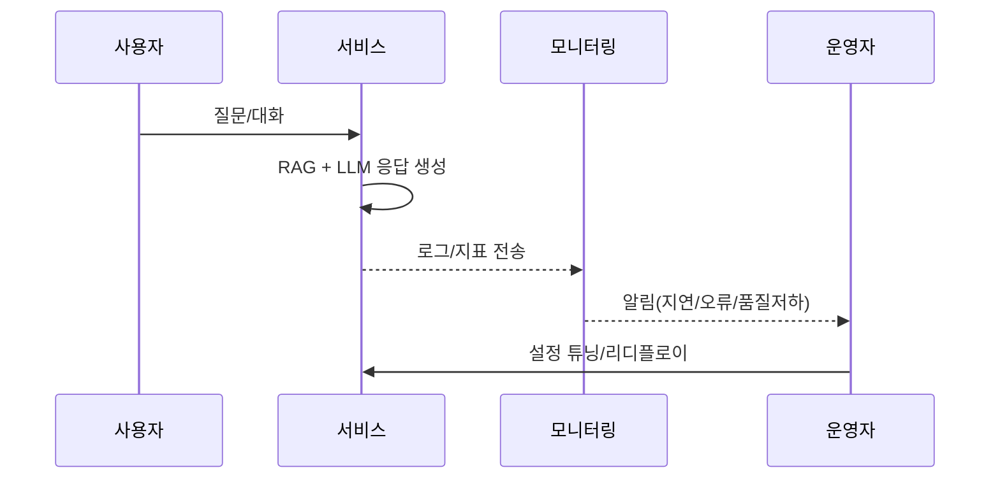

<!-- keep content -->
<style>
  /* Add/extend responsive rules */
  @media (max-width: 760px) {
    .cards{grid-template-columns:1fr 1fr; font-size:.85rem}
    .card h4{font-size:.8rem}
    .chart-container pre,
    .chart-container code{font-size:.8rem}
    .zebra th,.zebra td{padding:4px 6px;font-size:.8rem}
    .img-list img{max-height:260px;object-fit:contain}
  }
  @media (max-width: 480px) {
    .cards{grid-template-columns:1fr}
    .zebra th,.zebra td{font-size:.75rem}
  }
</style>

## AI tutor agent platform
강의 데이타, 교육학 이론, AI 특화 기술을 접목해 수강생생의 학습 효과를 극대화 하는 콘텐츠 생성

운영관리서비스
사용자 대화 및 학습 데티터를 분석하여 서비스 개선 인사이트를 얻고, 기업별 맟춤 데이터 연동과 커스터마이징 지원
* 실시간 모니터링
* 사용자 행동 분석
* 성과 측정
* 학습자 현황 관리
* 문제 조기 해결
* 성장 기회 발굴
* 서비스 품질 향상

강의 데이터 전처리 학습
질문 유사 자료의 검색 매칭
답변 품질 검증 및 보정

<!-- Visual enhancements -->
<style>
  .cards{display:grid;grid-template-columns:repeat(auto-fit,minmax(180px,1fr));gap:10px;margin:12px 0}
  .card{border:1px solid #e5e7eb;border-radius:8px;padding:10px;background:#fbfdff}
  .card h4{margin:0 0 8px 0;font-size:0.9rem}
  .sep{border:0;height:2px;background:linear-gradient(90deg,transparent,#cbd5e1,transparent);margin:16px 0}
  .zebra{border-collapse:collapse;width:100%}
  .zebra th,.zebra td{border:1px solid #e5e7eb;padding:6px 8px}
  .zebra tbody tr:nth-child(even){background:#f6f9fe}
  .chart-container{overflow-x:auto}
  /* one image per row + links */
  .img-list figure{margin:0 0 16px 0}
  .img-list img{width:100%;border:1px solid #eee;border-radius:6px;display:block}
  .img-list .links{margin-top:6px;font-size:.9rem}
</style>

## 오늘 한 일 요약
<div class="cards">
  <div class="card"><h4>배포</h4><div>voice-ai, likelion application 공개 및 링크 정리</div></div>
  <div class="card"><h4>수정</h4><div>Gemfile/lock, _config, include 문법, 이미지 경로</div></div>
  <div class="card"><h4>자동화</h4><div>createwiki 경로 수정, 테이블 자동 생성</div></div>
  <div class="card"><h4>환경</h4><div>JDK/rcc 경로 정리, Actions 빌드 안정화</div></div>
</div>

<hr class="sep" />

## 플랫폼 아키텍처(개요)
<div class="chart-container" markdown="1">

```mermaid
flowchart LR
  A[강의 데이터] --> B[전처리/정제]
  B --> C[지식베이스 구축 (벡터/메타)]
  C --> D[질의 이해(NLU)]
  D --> E[RAG 검색/매칭]
  E --> F[응답 생성(LLM)]
  F --> G[품질 검증·보정]
  G --> H[배포/대화 파이프라인]
  H --> I[모니터링/피드백]
  I --> B
```
</div>

## 운영/모니터링 플로우
<div class="chart-container" markdown="1">


</div>

## 핵심 지표(KPI)

| 항목 | 정의 | 목표 |
| --- | --- | --- |
| 응답 지연 | 사용자 요청→응답 완료 | p95 < 2.0s |
| 정확도 | 정답/가이드 일치율 | > 92% |
| 실패율 | 5xx/타임아웃 비율 | < 0.5% |
| 유지율 | 7일 재방문 | > 35% |
{:.zebra}

## 갤러리
아래 경로에 이미지를 저장하면 자동으로 표시됩니다.
- 폴더: /wiki-img/2025/diary/38th/

<div class="img-list">
  <figure>
    
    <div class="links">
      <a href="{{ '/wiki-img/2025/diary/38th/overview.png' | relative_url }}" target="_blank">원본 보기</a> ·
      <a href="{{ '/wiki-img/2025/diary/38th/overview_korean.png' | relative_url }}" target="_blank">한국어(korean.png)</a>
    </div>
  </figure>
  <figure>
    
    <div class="links">
      <a href="{{ '/wiki-img/2025/diary/38th/monitor.png' | relative_url }}" target="_blank">원본 보기</a> ·
      <a href="{{ '/wiki-img/2025/diary/38th/monitor_korean.png' | relative_url }}" target="_blank">한국어(korean.png)</a>
    </div>
  </figure>
  <figure>
    
    <div class="links">
      <a href="{{ '/wiki-img/2025/diary/38th/pipeline.png' | relative_url }}" target="_blank">원본 보기</a> ·
      <a href="{{ '/wiki-img/2025/diary/38th/pipeline_korean.png' | relative_url }}" target="_blank">한국어(korean.png)</a>
    </div>
  </figure>
  <figure>
    
    <div class="links">
      <a href="{{ '/wiki-img/2025/diary/38th/korean.png' | relative_url }}" target="_blank">원본 보기</a>
    </div>
  </figure>
</div>

Here’s an in-depth breakdown of how **Rasa**, **Ollama LLMs**, **LangChain**, **RAG**, and multimodal models like **LLaVA** and **MiniGPT-4** can interact **in a layered architecture**—from input to response generation—so you can build an advanced assistant system with:

* **Multimodal capabilities (image + text)**
* **Offline/local LLM support**
* **Retrieval-augmented memory**
* **Intent and dialogue logic**
* **Smart assistants in Korean or multilingual environments**

---

## 🔁 High-Level System Flow: Interaction Between All Components

```text
                          +------------------------+
                          |    User Input (Text /  |
                          |    Voice / Image / UI) |
                          +-----------+------------+
                                      |
       +------------------------------+------------------------------+
       |                                                             |
[Text Intent / Dialogue]                                  [Multimodal Input]
       |                                                             |
+------v------+                                             +--------v--------+
|   RASA NLU  |                                             |   LLaVA / MiniGPT-4 |
| (Intent +   |<--------------------------------------------|  (Image QA + Captioning)
|  Slot Filler|                                             +------------------+
+------+------+
       |
       |
       v
+---------------+               +-------------------------------------+
|  RASA CORE    | <-----------> |     Action Server (Python logic)    |
| Dialogue Mgmt |               | (DB Lookup, API Call, File Parser)  |
+-------+-------+               +-------------------+----------------+
        |                                           |
        |                                           |
        v                                           v
+---------------+                          +----------------------------+
| LLM via Ollama |                        | LangChain / LlamaIndex      |
| (e.g., Mistral |<------ RAG Input ------| - Vector DB (FAISS, Chroma) |
|  or Phi-2)     |                        | - Retrieval & Chunking      |
+---------------+                        +-----------------------------+

        ^                                                  |
        |                                                  |
        +------------------+-------------------------------+
                           |
                [RAG + LLM Answers Back to User]
```


## 📚 Example Use Cases and Interactions

| Scenario                                    | Tools Involved                | Flow                                                     |
| ------------------------------------------- | ----------------------------- | -------------------------------------------------------- |
| "보여준 표에서 가장 큰 수치는?" (Ask about chart image) | MiniGPT-4                     | Image → MiniGPT-4 → Caption/QA → Return                  |
| "이 파일 요약해줘" (Upload PDF)                    | LangChain + Ollama            | PDF → split + embed → retrieve relevant → answer via LLM |
| "지하철 언제 끊겨?" (Intent + API Call)            | Rasa → Action Server          | Intent → API request → response                          |
| "이건 무슨 단어야?" (Pronunciation + Vocabulary)   | Rasa + TTS + Whisper          | Intent → Pronunciation check → feedback                  |
| "이전 대화 다시 보여줘" (Context memory)             | LangChain memory or Redis     | Retrieve chat history + generate response                |
| "이 이미지에서 위험 요소 찾아줘"                         | LLaVA                         | Image input → object detection/QA → highlight result     |
| "나는 영어보다 한국어 발음이 어려워"                       | Ollama (Mistral multilingual) | User feedback → generate personalized study plan         |

---

## 🔧 Deployment Options

| Setup               | Description                                                                                      |
| ------------------- | ------------------------------------------------------------------------------------------------ |
| **Docker Compose**  | Bundle Ollama, Rasa, LangChain, vector DB, and image QA into a self-contained offline assistant. |
| **Local venv**      | Lightweight, better for dev or Raspberry Pi class hardware.                                      |
| **Remote Frontend** | SPA built with React or SvelteKit talking to Flask/FastAPI gateway that wraps these services.    |
| **On-Device App**   | Package via Tauri or Electron for Linux/Windows.                                                 |

---

## ✅ Suggested Next Steps

Coming  UP Next:

* [ ] Use `Ollama` to host your LLM base (Mistral or Phi-2).
* [ ] Use `LangChain` to enable document retrieval (`FAISS` + PDF ingestion).
* [ ] Add `RASA` to handle structured conversations with NLU and fallback to LLM when open-ended.
* [ ] Connect `MiniGPT-4`/`LLaVA` for multimodal support (charts, screenshots).
* [ ] Use Whisper for voice and ASR + TTS with Coqui or Silero.
* [ ] Add progress tracking, memory, and feedback loops (e.g., for learners or daily reports).


---
a real working Docker Compose config to integrate RASA + Ollama + LangChain + vector DB + Whisper







{{site.data.alerts.hr_shaded}}
