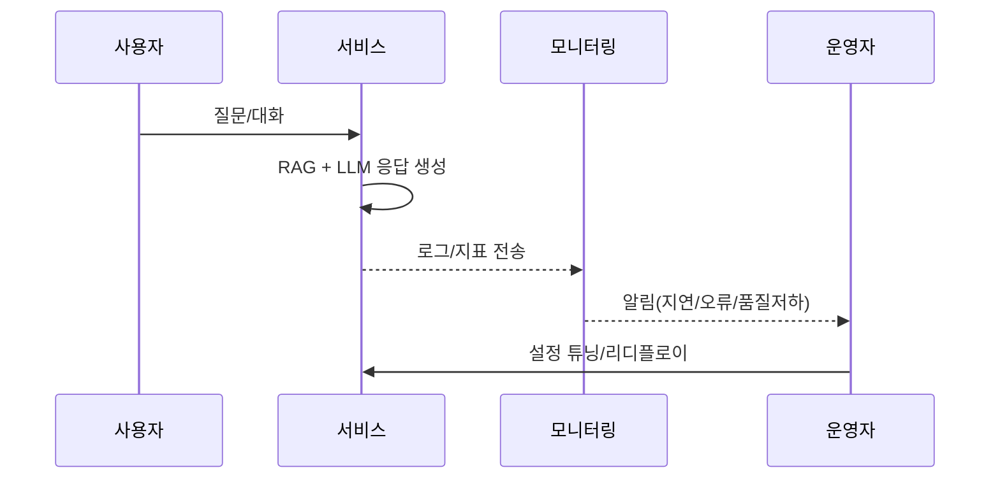

* TOC
{:toc}

Published voice-ai and likelion application pages. Standardized front matter and permalinks. Fixed Gemfile, lockfile, and _config tooltip. Corrected include syntax and image paths. Updated createwiki to write into _wiki/blog. Added themed HTML tables and an auto list of 2024 items tagged likelion. Resolved Actions failures (Bundler, YAML) and layout issues. Set local JDK and rcc paths.

## AI tutor agent platform
강의 데이타, 교육학 이론, AI 특화 기술을 접목해 수강생생의 학습 효과를 극대화 하는 콘텐츠 생성

운영관리서비스
사용자 대화 및 학습 데티터를 분석하여 서비스 개선 인사이트를 얻고, 기업별 맟춤 데이터 연동과 커스터마이징 지원
* 실시간 모니터링
* 사용자 행동 분석
* 성과 측정
* 학습자 현황 관리
* 문제 조기 해결
* 성장 기회 발굴
* 서비스 품질 향상

강의 데이터 전처리 학습
질문 유사 자료의 검색 매칭
답변 품질 검증 및 보정

<!-- Visual enhancements -->
<style>
  .cards{display:grid;grid-template-columns:repeat(auto-fit,minmax(180px,1fr));gap:10px;margin:12px 0}
  .card{border:1px solid #e5e7eb;border-radius:8px;padding:10px;background:#fbfdff}
  .card h4{margin:0 0 8px 0;font-size:0.9rem}
  .sep{border:0;height:2px;background:linear-gradient(90deg,transparent,#cbd5e1,transparent);margin:16px 0}
  .zebra{border-collapse:collapse;width:100%}
  .zebra th,.zebra td{border:1px solid #e5e7eb;padding:6px 8px}
  .zebra tbody tr:nth-child(even){background:#f6f9fe}
  .chart-container{overflow-x:auto}
  .img-grid{display:grid;grid-template-columns:repeat(auto-fit,minmax(220px,1fr));gap:10px}
  .img-grid img{width:100%;border:1px solid #eee;border-radius:6px}
</style>

## 오늘 한 일 요약
<div class="cards">
  <div class="card"><h4>배포</h4><div>voice-ai, likelion application 공개 및 링크 정리</div></div>
  <div class="card"><h4>수정</h4><div>Gemfile/lock, _config, include 문법, 이미지 경로</div></div>
  <div class="card"><h4>자동화</h4><div>createwiki 경로 수정, 테이블 자동 생성</div></div>
  <div class="card"><h4>환경</h4><div>JDK/rcc 경로 정리, Actions 빌드 안정화</div></div>
</div>

<hr class="sep" />

## 플랫폼 아키텍처(개요)
<div class="chart-container">

```mermaid
flowchart LR
  A[강의 데이터] --> B[전처리/정제]
  B --> C[지식베이스 구축 (벡터/메타)]
  C --> D[질의 이해(NLU)]
  D --> E[RAG 검색/매칭]
  E --> F[응답 생성(LLM)]
  F --> G[품질 검증·보정]
  G --> H[배포/대화 파이프라인]
  H --> I[모니터링/피드백]
  I --> B
```
</div>

## 운영/모니터링 플로우
<div class="chart-container">


</div>

## 핵심 지표(KPI)
| 항목 | 정의 | 목표 |
|---|---|---|
| 응답 지연 | 사용자 요청→응답 완료 | p95 < 2.0s |
| 정확도 | 정답/가이드 일치율 | > 92% |
| 실패율 | 5xx/타임아웃 비율 | < 0.5% |
| 유지율 | 7일 재방문 | > 35% |
{:.zebra}

## 갤러리
아래 경로에 이미지를 저장하면 자동으로 표시됩니다.
- 폴더: /wiki-img/2025/diary/38th/

<div class="img-grid">
  
  
  
</div>







{{site.data.alerts.hr_shaded}}
