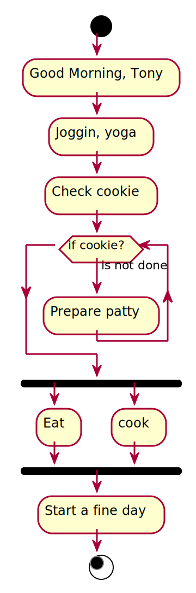

### Hello visitor, welcome to my Github portfolio wiki

## What do I do?
### Enjoy Engineering, Researching and Being a life amateur.

- 🔭 I’m currently working on a few meaningful things
- 🌱 Currently learning the art of life-long learning
- 🤔 I’m looking for help on figuring out how to help
- 💬 Ask me about how can I help, else internet has you covered ;)
- ⚡ Fun fact: 2021> I ran my first full lap around my neighborhood lake in 2 years; now I enjoy this fun everyday.

## 📫 Feel free to reach out
<table align="center">
  <tr>
     <td></td>  </tr>
  <tr>
     <td> </td> </tr>
  <tr>
     <td> </td>
  </tr>
  </table>

<h3 align="center">🛠️ Some of my digital Tools:</h3>

  

<h3 align="center"><a href="https://github.com/aiegoo">⌨GitHub Status(public):</a></h3>

  
  

<h3 align="left">Languages and Tools:</h3>

 
 
 
 
 
 
 
 
 
 
 
 
 
 
 
 
 
 
 
 
 
 
 
 
 
 
 
 
 
 
 
 
 
 
 
 
 
 
 
 
 
 
 
 
 
 
 
 
 
 
 
 
 

**aiegoo/portfolio** is a ✨ _special_ ✨ repository because its `README.md` (this file) appears on your GitHub profile.



### I belive in time-management

|---
|
| :-:
| 
| 
|================================================================
|




🎉 🎆 🔥

